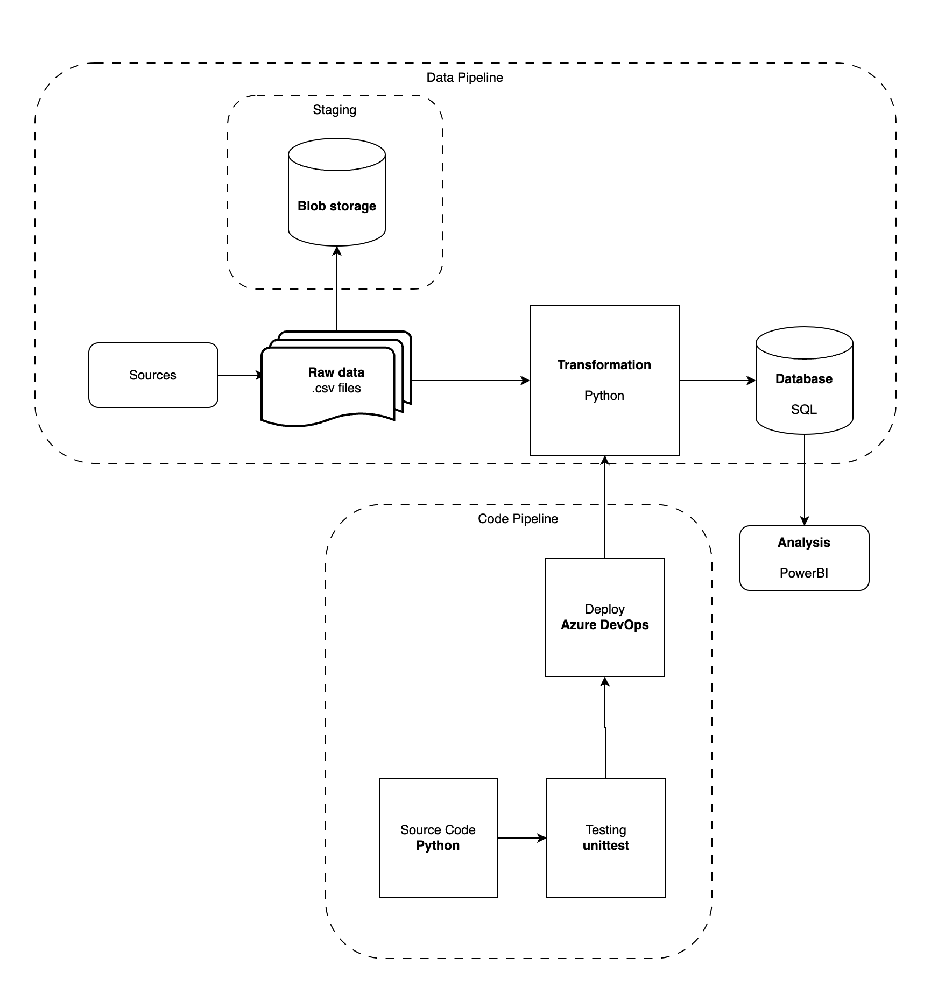

# DE5-M5

## Architectural Diagram

The proposed solution for the MVP:

## Solution Narrative
A python script loads in the data from csv and performs data quality / cleaning functions.

Customer data is cleaned by removing duplicates and N/A values.

Loan data is cleaned by:
- Removing duplicates (this includes blank rows)
- Cleaning date formatting
- Removing N/A values (which includes any which invalidated date formatting)
- Cleaning by date validity and loan duration
    - No future checkout or returned dates
    - Duration must be greater than 0

Loan data quality may be further enhanced by checking that loan duration is within the 14 day borrow period

Valid loans and customers are saved to loans_bronze and customers_bronze tables in the library MS SQL Server database.

Number of dropped rows by category for each entity (loan and customer) are stored in an engineering table in the database.

The results of the data import can be seen in the Power BI dashboard.

Demo implementation of Docker has been done, without the database connection. This could be further enhanced with a separate database image.
